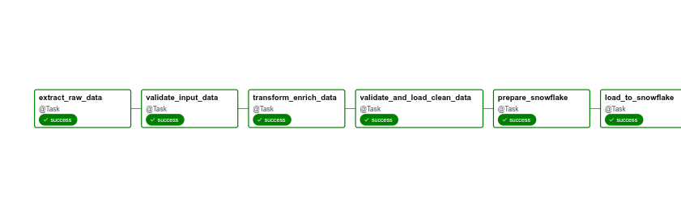
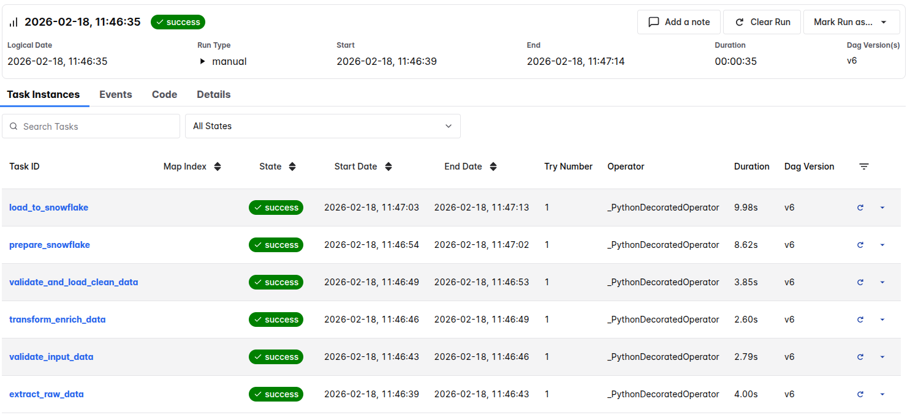

# Retail ETL Data Warehouse Pipeline

[](https://www.python.org/downloads/)
[](https://airflow.apache.org/)
[](https://www.snowflake.com/)
[](https://aws.amazon.com/s3/)
[](https://github.com/psf/black)
[](LICENSE)

A production-grade **ETL pipeline** built with **Apache Airflow** that processes retail sales data through multi-stage validation, transforms it with business logic, and loads it into a **Snowflake** data warehouse.

## Overview

This project demonstrates a complete end-to-end data pipeline for retail analytics that enforces data quality at every stage:

-   **Extract**: Reads raw sales and product data from AWS S3
-   **Validate**: Applies multi-stage data quality checks using Pandera schemas
-   **Transform**: Enriches data with business logic, calculations, and dimension joins
-   **Load**: Writes cleaned data to S3 and Snowflake data warehouse

The pipeline is **fully containerized**, **production-ready**, with comprehensive error handling, logging, and data quality enforcement.

## Key Features

### Data Quality First

-   ✅ Input validation with 3 data quality checks
-   ✅ Output validation before loading to warehouse
-   ✅ Automatic removal of invalid rows with detailed logging
-   ✅ Pandera schema enforcement for type safety

### Production-Ready Architecture

-   ✅ Retry logic (2 retries, 5-minute delay between attempts)
-   ✅ Email alerts on pipeline failures
-   ✅ Execution timeout enforcement (1 hour max)
-   ✅ Comprehensive logging throughout all stages

### Cloud-Native Integration

-   ✅ AWS S3 for data lake storage
-   ✅ Snowflake for cloud data warehousing
-   ✅ IAM-based authentication
-   ✅ Containerized with Astronomer Runtime

### Business Intelligence

-   ✅ Revenue calculations with discount handling
-   ✅ Flexible timestamp parsing (accepts mixed date formats)
-   ✅ Data enrichment via product metadata joins
-   ✅ Business flags for discounts and stock status
-   ✅ Hourly and daily aggregations ready

## Architecture

```
RAW DATA (S3 Bucket)
    ↓
[EXTRACT] → Sales CSV & Product JSON
    ↓
[VALIDATE INPUT] → Remove null/invalid rows (Pandera)
    ↓
[TRANSFORM] → Enrich, calculate revenue, merge with products
    ↓
[VALIDATE OUTPUT] → Final quality checks before load
    ↓
[LOAD] → S3 Processed Zone + Snowflake Warehouse
    ↓
CLEAN DATA (Ready for Analytics)
```

### Data Model: STAR Schema

-   **Fact Table**: `sales_clean` - transaction data
-   **Dimension Tables**:
    -   `products` - product metadata
    -   `regions` - regional information
    -   `dates` - time dimensions

## 📊 Pipeline Visualization

### DAG Graph View



Complete pipeline visualization showing all tasks and their dependencies:

-   Extract raw data from S3
-   Validate input data quality
-   Transform and enrich data
-   Validate output before loading
-   Load to Snowflake warehouse

### Task Execution History


_Task execution details with run history and performance metrics_

## 📁 Project Structure

```
.
├── dags/
│   └── retail_etl_dag.py              # Main Airflow DAG with 5 tasks
├── include/
│   ├── config.yaml                    # Configuration (S3, Snowflake)
│   ├── config.example.yaml            # Configuration template
│   ├── logger.py                      # Custom logging utility
│   ├── etl/
│   │   ├── __init__.py
│   │   ├── extract_s3.py              # S3 data extraction
│   │   ├── transform.py               # Business logic transformations
│   │   ├── load_s3_csv.py             # Write to S3 with error handling
│   │   └── load_snowflake.py          # Load to Snowflake warehouse
│   ├── validations/
│   │   ├── __init__.py
│   │   ├── input_schemas.py           # Pandera schemas for raw data
│   │   ├── output_schemas.py          # Pandera schemas for clean data
│   │   ├── validate_inputs.py         # Input validation functions
│   │   └── validate_outputs.py        # Output validation functions
│   └── utils/
│       ├── __init__.py
│       └── s3_paths.py                # S3 path utilities
├── data/
│   └── samples/
│       ├── sales_data.csv             # Sample sales transactions
│       └── product_data.json          # Sample product metadata
├── docs/
│   ├── API.md                         # API documentation
│   ├── ARCHITECTURE.md                # Architecture overview
│   ├── CONTRIBUTING.md                # Contributing guidelines
│   ├── DEPLOYMENT.md                  # Deployment instructions
│   ├── MONITORING.md                  # Monitoring & alerting guide
│   ├── PROJECT_STRUCTURE.md           # Detailed project structure
│   ├── QUICKSTART.md                  # Quick start guide
│   ├── VALIDATION.md                  # Validation framework docs
│   ├── snapshots/                     # Pipeline screenshots
│   └── sql/
│       ├── setup_snowflake.sql        # DDL for Snowflake tables & roles
│       └── sample_queries.sql         # Sample analytics queries
├── tests/
│   ├── conftest.py                    # Pytest configuration
│   ├── test_etl_functions.py          # Unit tests for transforms
│   └── test_validations.py            # Unit tests for validators
├── .env.example                       # Environment variables template
├── .gitignore
├── Dockerfile                         # Astronomer container config
├── airflow_settings.yaml              # Airflow configuration
├── packages.txt                       # System dependencies
├── pytest.ini                         # Pytest configuration
├── requirements.txt                   # Python dependencies
└── README.md                          # This file
```

## � Documentation

All documentation files are organized in the `docs/` folder:

| Document                                          | Purpose                                |
| ------------------------------------------------- | -------------------------------------- |
| [QUICKSTART.md](docs/QUICKSTART.md)               | 5-minute quick start guide             |
| [ARCHITECTURE.md](docs/ARCHITECTURE.md)           | Complete system architecture overview  |
| [DEPLOYMENT.md](docs/DEPLOYMENT.md)               | Production deployment guide            |
| [MONITORING.md](docs/MONITORING.md)               | Monitoring, alerting & troubleshooting |
| [VALIDATION.md](docs/VALIDATION.md)               | Data validation framework guide        |
| [PROJECT_STRUCTURE.md](docs/PROJECT_STRUCTURE.md) | Detailed project structure reference   |
| [API.md](docs/API.md)                             | API endpoint documentation             |
| [CONTRIBUTING.md](docs/CONTRIBUTING.md)           | Contribution guidelines                |

**SQL Resources** (`docs/sql/`):

-   `setup_snowflake.sql` - DDL for creating Snowflake tables, warehouses, and roles
-   `sample_queries.sql` - Example analytics queries for the cleaned data

## �🚀 Getting Started

### Prerequisites

-   Docker & Docker Compose
-   Astronomer CLI: `pip install astro-cli`
-   AWS account with S3 access
-   Snowflake account (for full pipeline)
-   Python 3.10+

### Local Development Setup

1. **Clone the repository**

    ```bash
    git clone https://github.com/kaweeo/retail-ETL-pipeline-with-Apache-Airflow.git
    cd retail-ETL-pipeline-with-Apache-Airflow
    ```

2. **Configure AWS credentials**

    ```bash
    export AWS_ACCESS_KEY_ID=your_access_key
    export AWS_SECRET_ACCESS_KEY=your_secret_key
    export AWS_DEFAULT_REGION=eu-central-1
    ```

3. **Update configuration** (`include/config.yaml`)

    ```yaml
    aws_conn_id: aws_conn_id
    s3:
        bucket: your-bucket-name
        raw_folder: retail-data/
        cleansed_folder: cleansed-data/
        sales_key: sales_data.csv
        products_key: product_data.json
        processed_sales_key: sales_clean.csv
    ```

4. **Start Airflow locally**

    ```bash
    astro dev start
    ```

    - Airflow UI: http://localhost:8080/
    - Username: `admin` | Password: `admin` (default)

5. **Trigger the DAG manually**
    ```bash
    astro dev run dags test retail_etl_pipeline 2026-01-01
    ```

## 🔧 Configuration

### Airflow Connections

Add these connections in Airflow UI or `airflow_settings.yaml`:

```yaml
airflow:
    connections:
        - conn_id: aws_conn_id
          conn_type: aws
          conn_login: ${AWS_ACCESS_KEY_ID}
          conn_password: ${AWS_SECRET_ACCESS_KEY}

        - conn_id: my_snowflake_conn
          conn_type: snowflake
          conn_login: your_username
          conn_password: your_password
          conn_host: your-account.snowflakecomputing.com
          conn_extra:
              {
                  "account": "your-account",
                  "warehouse": "RETAIL_DATA_WH",
                  "database": "RETAIL_DATA",
                  "role": "ETL_ROLE",
              }
```

### S3 Bucket Structure

```
s3://your-bucket-name/
├── retail-data/           # Raw data zone
│   ├── sales_data.csv     # Sales transactions (2500+ records)
│   └── product_data.json  # Product metadata
└── cleansed-data/         # Processed data zone
    └── sales_clean.csv    # Cleaned and transformed data
```

## 📦 Pipeline Stages in Detail

### Stage 1: Extract (`extract_s3.py`)

-   Reads sales.csv from S3 raw folder
-   Reads product_data.json from S3 raw folder
-   Normalizes column names (lowercase + underscores)
-   Returns Pandas DataFrames for processing

### Stage 2: Input Validation (`validate_inputs.py`)

**Sales Data Validation:**

-   `sales_id`, `product_id`: Non-null integers
-   `qty`: Positive integers only (> 0)
-   `order_status`: Must be "Completed"
-   `price`: Valid positive numeric values
-   `timestamp`: Accepts mixed date formats

**Product Data Validation:**

-   `product_id`: Non-null integer key
-   `category`, `brand`: Non-null strings
-   `rating`: 0-5 numeric range
-   `in_stock`: Boolean flag

Invalid rows are automatically removed with detailed logging

### Stage 3: Transform (`transform.py`)

1. Filter to completed orders only
2. Normalize region to uppercase (handle nulls → "UNKNOWN")
3. Parse timestamps with flexible format support
4. Calculate revenue: `qty × price × (1 - discount)`
5. Filter out negative prices/revenues
6. Left join product metadata by product_id
7. Create business flags: `is_discounted`, `is_in_stock`
8. Extract date and hour from timestamps
9. Type casting for schema compliance

### Stage 4: Output Validation (`validate_outputs.py`)

-   Enforces strict schema compliance
-   Validates ranges (e.g., `sale_hour`: 0-23)
-   Ensures no nulls in critical fields
-   Positive values for price & revenue
-   Type checking for all columns

### Stage 5: Load (`load_s3_csv.py`)

-   Writes clean CSV to S3 processed zone
-   Includes error handling for S3 operations
-   Logs success/failure metrics
-   Compatible with Snowflake ingestion

## 🧪 Testing

```bash
# Install test dependencies
pip install pytest pytest-cov pandas

# Run all tests
pytest tests/ -v

# Run with coverage report
pytest tests/ --cov=include/ --cov-report=html

# Run specific test file
pytest tests/test_validations.py -v
```

## 📈 Monitoring & Troubleshooting

### View Logs

```bash
# View Airflow logs
astro dev logs -f

# Check specific task logs in Airflow UI
# Browse → Task Instances → Click on task → Log
```

### Common Issues & Solutions

| Issue                          | Solution                                             |
| ------------------------------ | ---------------------------------------------------- |
| S3 connection fails            | Verify AWS credentials in Airflow connections        |
| Pandera validation errors      | Check error logs for column/type mismatches          |
| Empty dataset after validation | Review raw data against input_schemas.py             |
| Snowflake ingestion fails      | Verify warehouse/database exists and has permissions |
| DAG not appearing in UI        | Check DAG file for syntax errors                     |

## ⚡ Performance

-   **Schedule**: Daily optimization for ~2500 records/run
-   **Execution Time**: ~2-5 minutes (depends on S3 network latency)
-   **Parallel Runs**: Single DAG run for data consistency
-   **Scaling**: Modify `max_active_runs` in DAG for concurrent executions

## 🛠 Technology Stack

| Component        | Technology     | Version              |
| ---------------- | -------------- | -------------------- |
| Orchestration    | Apache Airflow | 2.x (Astronomer 3.0) |
| Data Processing  | Pandas         | 2.1.4                |
| Data Validation  | Pandera        | 0.24.0               |
| Cloud Storage    | AWS S3 (boto3) | 1.38.44              |
| Data Warehouse   | Snowflake      | 3.15.0               |
| Containerization | Docker         | Astronomer Runtime   |
| Testing          | Pytest         | 7.x                  |
| Code Style       | Black          | 24.x                 |

## 🔮 Future Enhancements

-   [ ] Add dbt for advanced transformations
-   [ ] Implement Great Expectations for data validation
-   [ ] Add real-time streaming with Kafka
-   [ ] Create Looker/Tableau dashboards
-   [ ] Implement data quality monitoring alerts
-   [ ] Add ML-based anomaly detection
-   [ ] Parquet output for better performance
-   [ ] Incremental loading patterns

## 📄 License

This project is licensed under the MIT License - see the [LICENSE](LICENSE) file for details.

## 🙏 Acknowledgments

-   Astronomer for the excellent Airflow runtime
-   Snowflake for data warehouse capabilities
-   AWS for cloud infrastructure
-   Open source community for amazing tools


Built with ❤️ for production data engineering
